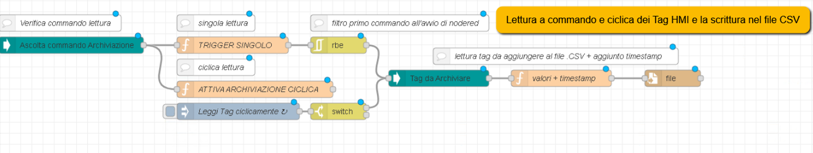
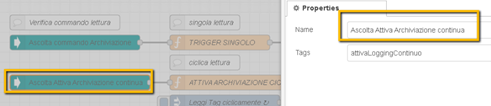

# edge-sharefile-unified
Node-RED image for Unified Comfort Panel, containing basic nodes for reading filedirectory SMB, e-mail and database.

## Table of Contents

- [edge-sharefile-unified](#edge-sharefile-unified)
  - [Table of Contents](#table-of-contents)
  - [Install the App](#install-the-app)
    - [Requirements](#requirements)
    - [Download the App](#download-the-app)
    - [Prerequisites](#prerequisites)
    - [Load App on Unified Comfort Panels](#load-app-on-unified-comfort-panels)
  - [Run the App](#run-the-app)
  - [Extra Mapped Port for Additional Services](#extra-mapped-port-for-additional-services)
  - [WinCC Unified Communication with OpenPipe Nodes](#wincc-unified-communication-with-openpipe-nodes)
  - [Extra nodes in package.json](#extra-nodes-in-packagejson)
  - [How the App is built from scratch](#how-the-app-is-built-from-scratch)
    - [```package.json```](#packagejson)
    - [```docker-compose.yml```](#docker-composeyml)
    - [```Dockerfile```](#dockerfile)
  - [Import in Edge App Publisher](#import-in-edge-app-publisher)
  - [References](#references)
  - [Release History](#release-history)
  - [License](#license)
  - [Contributing](#contributing)

## Requirements

This application example comes with pre-builded ```edge-node-red-smb-unified_x.x.x.app``` package that can be installed specifically on Unified Comfort Panels that run SIMATIC Edge Runtime.

> Before loading this application, check if the requirements below are satisfied by the selected Edge Device for installation.

In order to run this Edge App, the selected Edge System need to satisfy the following requirements:

| Description                    |           |
|--------------------------------|-----------|
| Available Working Memory (RAM) | >= 768 MB |

#### Hardware Requirements

- The ```edge-node-red-smb-unified``` app is only compatible with **WinCC Unified Panels** devices that have **SIMATIC Edge** functionality enabled. For details on how to enable Edge functionality see chapter [Edge Enablement on Unified Comfort Panels](#edge-enablement-on-unified-comfort-panels).  

#### Software Requirements

- The ```edge-node-red-smb-unified``` app requires **768MB** of **RAM** to run. The current limit of RAM available to Industrial Edge applications on WinCC Unified Panels devices is 768MB and for this reason no other Edge application can be running in parallel with the ```edge-node-red-smb-unified``` application.
- The ```edge-node-red-smb-unified``` app requires an active and properly configured **WinCC Unified project** present on the WinCC Unified Panel device. For details on how to integrate the ```edge-node-red-smb-unified``` app into a new WinCC Unified project see chapter [WinCC Unified Configuration](#wincc-unified-configuration).
- WinCC Unified and the ```edge-node-red-smb-unified``` app require to use the Engineering software **TIA Portal V17** - [SIOS download link](https://support.industry.siemens.com/cs/document/109784440/simatic-step-7-incl-safety-s7-plcsim-and-wincc-v17-trial-download?dti=0&lc=en-IT).
- Firmware update v17 is required to be installed on the WinCC Unified Panel - [SIOS download link](https://support.industry.siemens.com/cs/document/109746530/image-downloads-for-hmi-operator-panels?dti=0&lc=en-IT).

## Node-RED App

The **edge-node-red-smb-unified** app can be downloaded in .app format using this secure Google Drive link:

- [edge-node-red-smb-unified_0.0.1.app](https://drive.google.com/file/d/1xPnGRFFIac4HN3iM4opUpG5qIC1rrSgs/view?usp=sharing)

### App download and installation

To load the app on Unified Comfort Panels:

1. Copy the downloaded ```edge-node-red-smb-unified_x.x.x.app``` file to your Developer PC.
2. Open the Industrial Edge Management Web Page of UCP on ```https://<ucp-address>```.
3. Import the .app file using the *Import Offline* button.


4. Wait until the app is installed on the device.


### Run the App

Once the app has been installed the Docker service starts running immediately.

You can access the app web interface by clicking on the *edge-node-red-smb-unified* app icon in Edge Device Web Page or through endpoint.
The app has two HTTPS Endpoints configured with SIMATIC Edge Reverse Proxy function:

- ```https://<ied-address>/edge-node-red``` : this endpoint opens up the Node-RED editor interface. This is the default endpoint.
- ```https://<ied-address>/edge-node-red-ui``` : this endpoint opens up the Node-RED Web Dashboard.

To open the Node-RED editor a user must be logged.Below the default Login credentials:

- **user:** edge
- **password:** edge


> A user must be logged on Edge Device in order to open Reverse Proxy App endpoints. If no user is logged the endpoint URL will give Error 503 on load.

If you need, is it possible to access the app Endpoints also by using the following direct URLs with mapped ports:

- ```https://<ied-address>:41880``` : this endpoint open the Node-RED editor interface.
- ```https://<ied-address>:41880/edge-node-red-ui``` : this endpoint open the Node-RED Web Dashboard.

### Extra nodes in package.json

This App is based on the official [Node-RED Docker Image](https://hub.docker.com/r/nodered/node-red).
On Node-RED Documentation Website you can find more information on [How to Run Node-RED Docker](https://nodered.org/docs/getting-started/docker) and how to generate [Image Variation](https://nodered.org/docs/getting-started/docker#image-variations) for own customization.

In fact, Node-RED comes with a core set of useful nodes, but there are many more available from both the Node-RED project as well as the wider community.
You can search for available nodes in the [Node-RED library](https://flows.nodered.org/).

To add any extra nodes on Node-RED Docker base image it is necessary to insert them into the original ```package.json``` file available from [node-red-docker Repository](https://github.com/node-red/node-red-docker) and build a new docker image.

The following snippets of ```package.json``` file lists all the extra nodes installed in this Node-RED App:

```json
{
  ...
  ...
    "dependencies": {
        "node-red": "1.3.5",
        "node-red-hmi-subscribe-alarms": "file:hmi-runtime-subscribe-alarms",
        "node-red-hmi-subscribe-tags": "file:hmi-runtime-subscribe-tags",
        "node-red-hmi-write-tags": "file:hmi-runtime-write-tags",
        "node-red-hmi-read-tags": "file:hmi-runtime-read-tags",
        "node-red-hmi-read-alarms": "file:hmi-runtime-read-alarms",
        "node-red-contrib-ftp": "*",
        "node-red-node-base64": "*",
        "node-red-node-msgpack": "*",
        "node-red-node-random": "*",
        "node-red-node-suncalc": "*"
    }
}
```

You can also install nodes directly within the editor by selecting the ```Manage Palette``` option from the main menu to open the [Palette Manager](https://nodered.org/docs/user-guide/editor/palette/manager).

On Node-RED Documentation Website you can find more information on how to [Add nodes to the palette](https://nodered.org/docs/user-guide/runtime/adding-nodes).

## Application example

### Overview
This example shows how to archive five tags into a CSV file. The CSV file will be stored in the Application Volumes of Node-RED application cyclically, and will be then be copied periodically into a shared folder of a Windows PC and then sent by email.

### Shared folder settings

From version 1709 of Windows 10, folder sharing via SMB protocol is disabled by default. The operations described in this paragraph allow to define a shared folder with correct settings and accesses.


To access the folder, you need to create a new Windows user with a certain username and password. Please note that, in order to activate the new account, the PC must be restarted.


Once restarted the PC, set the remote access rights to the folder for the new user, as shown below.


Check if the folder is reachable via ```\\IPAddress\SharedFolder```.


In case of access problems, check the following settings: **File sharing setting and network discovery**.


Check the allowed accesses as follows.


### WinCC Unified TIA Portal Project Upload
The included TIA Portal project is provided as an archive with a .zap17 extension. Therefore, it will be necessary to unarchive it.

1. Use the provided archived project file edgetest.zap17. You can open the file with TIA Portal by double-clicking it.
2. Upon opening you will be prompted for the save path of the retrieved TIA Portal project. Choose the folder of interest.
3. Navigate to the **Project View** and in the **Devices and Networks** section configure the Unified Comfort Panel named "HMI_1" according to your network and hardware.
4. Once you have adapted the project for your Unified Comfort Panel device, download the project using the **Download** button.
5. Start the project on the Unified Comfort Panel device.

Below the HMI tags used and stored in this application example.


### Data processing in Node-RED
For HMI tags saving into a CSV file and for sending it by email, the following flows in Node-RED are used. For each flow used, below a brief explanation is presented.

1. This first flow creates a file directory and sets the header of the CSV file that will contain the data points of the HMI tags values. CSV file creation is triggered daily and the file is newly created if not already present in the defined file directory. 


In this application example the considered file path is ```data/test/```, which is already configured in Node-RED application. Eventually, if needed, the path can be changed.


The **header** variable contains the structure of the CSV file. In this example the first column of the CSV file will be the timestamp (date and time of the acquired data), followed by one column for each variable name. In the configuration node, all CSV column names must be separated by a comma, as shown in the figure below for **header** variable.

HMI tag names are instead listed in **taglist** variable, separated by a space.


The **Generate Filename** function node below takes care of decomposing the date and time of the panel so as to use them for the name of the generated CSV file. The file name will therefore be of the following type: ***logfile_2021_12_31.csv***. 

If necessary, it is possible to modify the names of the CSV files by changing the Javascript function defined within this node.


2. The second flow of this application example cyclically reads the HMI tags selected and save them into the CSV file.



More in details, in the node highlighted below, the name of the HMI tag used as trigger must be written. This trigger is used to manually launch other HMI tags archiviation for a single read operation.


In the following flow, HMI tag ```attivaLoggingContinuo``` is instead used as a trigger to activate a cyclic reading of the HMI tags.



HMI tags are read and stored every 5 seconds. This parameter is configurable inside the *inject* node below:


As for the node highlighted below, the following parameters need to be configured:
- user: username;
- pw : password;
- smb = "//IP/sharedfolder".
- smb_path = "/subfolder".

```smb``` variable is the path of the shared folder, specified by using the IP address.
```smb_path``` is instead the name of the subfolder inside the shared folder.


3. The flow below cyclically reads the Unified Comfort Panel folder and gives as an output the list of the filenames contained. Through the defined user credentials, all files are copied from the Unified Comfort Panel folder to the Windows shared folder.


4. Last flow of this application example, reads the files in the directory, filters for CSV files only and, if any, sends them to the configured email address.


In details, the *inject node* above, triggers the email sending every Friday at 23:59.


In **Generate Email** node, the email body must be specified, together with the recipient and the subject of the email.
- *msg.topic*: email subject.
- *msg.payload*: email body.
- *msg.to*: email recipient.


For email sending to the recipient specified, the Node-RED node uses the following settings:
- Server: smtp server of the provider.
- Port: port *25* for non encrypted emails, ports *465* o *587* with TLS.
- UserId:  email address of sender.
- Password: password of email account. In case of Gmail, check the following [link](https://support.google.com/accounts/answer/185833?hl=it). It might be necessary to authorize the access for external devices, as described in this [link](https://support.google.com/accounts/answer/6010255).


## Documentation

- [SIOS Application Example NodeRED](https://support.industry.siemens.com/cs/ww/en/view/109778780) - This application example is based on the following Siemens Industry Online Support Application example provided by Siemens.
- [Node-RED Library](https://flows.nodered.org/) - Official Node-RED Collection of Nodes and Example Flows.
- [Node-RED Docker Image](https://hub.docker.com/r/nodered/node-red) - Official Node-RED Docker Image from Docker Hub.
- [Node-RED Documentation](https://nodered.org/docs/) - Node-RED Documentation Portal for every needs.
- [OpenPipe Manual](https://support.industry.siemens.com/cs/it/en/view/109778823) - Siemens Industry Support Manual for OpenPipe Communication functions understanding.

You can find further documentation and help about Industrial Edge in the following links:

- [Industrial Edge Hub](https://iehub.eu1.edge.siemens.cloud/#/documentation)
- [Industrial Edge Forum](https://www.siemens.com/industrial-edge-forum)
- [Industrial Edge landing page](https://new.siemens.com/global/en/products/automation/topic-areas/industrial-edge/simatic-edge.html)
- [Industrial Edge GitHub page](https://github.com/industrial-edge)
- [Industrial Edge App Developer Guide](https://support.industry.siemens.com/cs/ww/en/view/109795865)

## Contribution

Thanks for your interest in contributing. Anybody is free to report bugs, unclear documentation, and other problems regarding this repository in the Issues section or, even better, is free to propose any changes to this repository using Merge Requests.

## License & Legal Information

Please read the [Legal Information](LICENSE.md).
